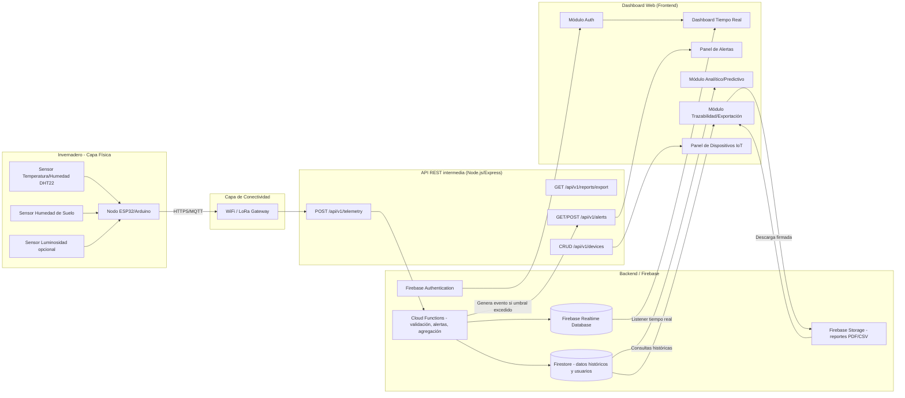

# SPECS.md - Plataforma Web GREEN TECH

**Proyecto:** Sistema Inteligente de Automatización GREEN TECH
**Equipo:** Palarix — Universidad Tecnológica de Tlaxcala (UTT)
**Versión del documento:** 1.0
**Estado:** Fuente única de la verdad (Single Source of Truth) para desarrollo Frontend/Backend

---

## 0. Resumen Ejecutivo

GREEN TECH es una red sensorial inalámbrica (nodos ESP32/Arduino) que monitorea condiciones ambientales de invernaderos de jitomate y alimenta una plataforma web/móvil sobre Firebase, actuando como "cerebro" del sistema. El objetivo es reducir pérdidas de cultivo por estrés térmico e hídrico mediante una interfaz de "tecnología invisible": simple, basada en códigos de color, pensada para productores con brecha digital, sin sacrificar la trazabilidad exigida para exportación (SENASICA, EE. UU., Canadá) ni el cumplimiento de la LFPDPPP.

---

## 1. Arquitectura General del Sistema y Flujo de Datos

### 1.1 Diagrama de Flujo (Mermaid)



### 1.2 Estrategia de Sincronización: Tiempo Real vs. Persistencia Histórica

**Principio de diseño:** separar la ruta "caliente" (datos en vivo, baja latencia) de la ruta "fría" (datos históricos, alto volumen, consultas analíticas).

| Capa | Tecnología | Propósito | TTL / Retención |
|---|---|---|---|
| Tiempo real | **Firebase Realtime Database (RTDB)** | Última lectura por nodo (`/live/{greenhouseId}/{nodeId}`), usada por listeners `onValue()` del Dashboard | Se sobrescribe cada lectura (no acumula) |
| Histórico | **Cloud Firestore** | Colección `telemetry_data`, una escritura por lectura de sensor (append-only), usada para gráficos de tendencias, analítica y trazabilidad | Según política de retención (ver sección 4.2) |
| Eventos | **Cloud Functions (trigger onWrite en RTDB)** | Al recibir una lectura, valida contra umbrales y, si corresponde, escribe en `alerts` y dispara notificación push (FCM) | N/A |

- El **SDK de Firebase Realtime Database** se usa para las tarjetas de métricas en vivo del Dashboard (actualización sub-segundo, ideal para pocas escrituras muy frecuentes por nodo).
- **Firestore** se usa como fuente de verdad histórica indexada por invernadero + timestamp, optimizada para las consultas de rango de fecha que alimentan gráficos de 24h/semana, reportes SENASICA y modelos predictivos.
- No se usan WebSockets propios: el SDK cliente de Firebase ya gestiona la conexión persistente y la reconexión automática en caso de pérdida de red, comportamiento crítico dado que muchos invernaderos tienen conectividad intermitente.
- **Modo offline:** el Dashboard debe habilitar `enablePersistence()` (Firestore offline cache) para que el operador pueda revisar el último estado conocido sin conexión.
- **Buffer en el nodo ESP32:** si el nodo pierde conexión, almacena localmente (SPIFFS/EEPROM) hasta N lecturas y las reenvía con su timestamp original al reconectar, evitando huecos en la trazabilidad.

---

## 2. Especificación de Módulos y Vistas (Frontend)

### A. Módulo de Autenticación (Auth)

**Componentes de UI:**
- Pantalla de Login: logo GREEN TECH, campo "Usuario/Correo", campo "Contraseña" (con ícono de mostrar/ocultar), botón grande "Iniciar Sesión", enlace "¿Olvidaste tu contraseña?".
- Diseño mobile-first, botones grandes (mínimo 48x48px táctil), tipografía mínima 16px, alto contraste, iconografía en vez de texto extenso donde sea posible (pensado para usuarios con brecha digital).
- Pantalla de recuperación: input de correo o número de teléfono registrado → envío de código OTP de 6 dígitos (SMS o correo) → pantalla de captura de código → pantalla de nueva contraseña.

**Interacciones:**
1. Usuario ingresa credenciales → `signInWithEmailAndPassword()` (Firebase Auth).
2. Sistema valida rol del usuario en Firestore (`users/{uid}.role`) y redirige:
   - `admin` → Dashboard completo + Panel de Dispositivos + Trazabilidad.
   - `operador` → Dashboard + Alertas (vista simplificada, sin analítica financiera ni exportación SENASICA).
3. Recuperación de contraseña: `sendPasswordResetEmail()` o flujo OTP vía Cloud Function + proveedor SMS (ej. Twilio) para usuarios sin correo activo.

**Roles de usuario:**

| Rol | Permisos |
|---|---|
| **Administrador** (Dueño del invernadero) | Acceso total: dashboard, alertas, analítica/ROI, trazabilidad/exportación, gestión de dispositivos, gestión de usuarios/operadores |
| **Operador agrícola** | Acceso a: dashboard en tiempo real, panel de alertas (solo lectura + confirmar/atender alerta), estado de dispositivos (solo lectura). Sin acceso a exportación SENASICA ni configuración de umbrales |

**Mensajes de error/éxito:**
- Error: "Usuario o contraseña incorrectos. Verifica tus datos e intenta de nuevo." (nunca especificar cuál campo falló, por seguridad).
- Error de red: "No hay conexión a internet. Revisa tu red Wi-Fi o datos móviles."
- Éxito recuperación: "Te enviamos un código a tu correo/teléfono registrado."
- Bloqueo por intentos: "Demasiados intentos fallidos. Intenta de nuevo en 5 minutos." (rate limiting vía Firebase App Check + Cloud Function).

**Lógica de negocio:**
- Sesión persistente por 30 días en dispositivo de confianza (evitar reinicios de sesión constantes en campo).
- Bloqueo temporal tras 5 intentos fallidos consecutivos (5 minutos).
- Todo login exitoso registra `lastLogin` y `deviceInfo` en `users/{uid}` para auditoría.

---

### B. Dashboard de Monitoreo en Tiempo Real (Core)

**Componentes de UI:**
- **Selector de invernadero/sector** (dropdown o tabs) en la parte superior, si el usuario administra más de uno.
- **Tarjetas de métricas clave** (una por variable): Temperatura (°C), Humedad Relativa (%), Humedad del Suelo (%). Cada tarjeta muestra: ícono representativo, valor numérico grande, unidad, tendencia (flecha ↑↓ vs. lectura anterior), y borde de color de semáforo.
- **Sistema de Semáforo (UI Visual):**

| Estado | Color | Rango orientativo (jitomate) | Icono sugerido |
|---|---|---|---|
| Óptimo | 🟢 Verde (`#2ECC71`) | Temp 18–27°C, HR 60–80%, Humedad suelo 60–80% | Check / hoja sana |
| Precaución | 🟡 Amarillo (`#F1C40F`) | Temp 27–32°C o 12–18°C, HR 40–60% u 80–90%, Humedad suelo 40–60% u 80–90% | Signo de alerta suave |
| Crítico | 🔴 Rojo (`#E74C3C`) | Temp >32°C o <12°C, HR <40% o >90%, Humedad suelo <40% (estrés hídrico) | Signo de alerta + vibración/parpadeo sutil |

  - Los umbrales exactos son configurables por invernadero (ver Panel de Alertas, sección C) — los valores de la tabla son el valor por defecto de fábrica.
  - El color debe ser el elemento dominante de la tarjeta (fondo o borde grueso), no solo un texto pequeño, para lectura rápida a distancia.
- **Gráficos interactivos de tendencias:** líneas de tiempo por variable, selector de rango (Últimas 24h / Última semana), tooltip al pasar el cursor/tap mostrando valor y hora exacta. Librería sugerida: Recharts o Chart.js.
- **Indicador de "última actualización hace Xs"** para transparencia sobre la vigencia del dato en pantalla.

**Interacciones:**
- Tap/click en tarjeta → expande mini-gráfico de esa variable específica.
- Deslizar o tocar el selector de rango de tiempo recarga la consulta a Firestore (`where('timestamp', '>=', rango)`).
- Pull-to-refresh en móvil fuerza reconexión del listener en tiempo real.

**Mensajes de error/éxito:**
- Sin datos recientes (>15 min sin lectura): banner amarillo "Sin datos recientes del Sector X. Verifica la conexión del sensor."
- Nodo caído: tarjeta muestra estado gris "Sin conexión" en lugar de semáforo.
- Carga exitosa silenciosa (no se notifica cada actualización para no saturar al usuario).

**Lógica de negocio:**
- El color de semáforo se calcula tomando el **peor caso entre las 3 variables** (si una está en rojo, la tarjeta resumen del invernadero se marca roja) — política "el eslabón más débil".
- Se promedian lecturas de múltiples sensores del mismo sector antes de determinar el color, para evitar falsos positivos por un sensor defectuoso puntual.

---

### C. Panel de Alertas y Notificaciones

**Componentes de UI:**
- Lista cronológica (más reciente primero) de alertas históricas, cada ítem muestra: ícono de severidad, descripción ("Temperatura > 35°C en Sector 2"), timestamp, sector afectado, estado (Nueva / Atendida / Resuelta automáticamente).
- Filtros por: severidad, sector, rango de fechas, estado.
- Formulario de "Configuración de umbrales" (solo rol Administrador): sliders o inputs numéricos por variable y por nivel (amarillo/rojo), con botón "Guardar configuración" y "Restaurar valores por defecto".
- Badge numérico de alertas no atendidas en el ícono de navegación del módulo.

**Interacciones:**
1. Cloud Function detecta lectura fuera de umbral → escribe documento en `alerts` → envía notificación push (FCM) a usuarios suscritos a ese invernadero.
2. Usuario toca la alerta → detalle expandido con gráfico de la variable en el momento del evento.
3. Botón "Marcar como atendida" (operador) registra `attendedBy`, `attendedAt`.
4. Administrador ajusta umbral → se guarda en `greenhouses/{id}/thresholds` y aplica a futuras lecturas (no retroactivo).

**Mensajes de error/éxito:**
- Éxito al guardar umbral: "Umbrales actualizados correctamente para [Sector]."
- Error de validación: "El valor mínimo no puede ser mayor al máximo."
- Confirmación antes de restaurar valores por defecto: "¿Seguro que deseas restaurar los umbrales de fábrica? Esta acción no se puede deshacer."

**Lógica de negocio:**
- Anti-spam de alertas: si una condición crítica persiste, no se genera una alerta nueva cada lectura; se agrupa en una sola alerta "activa" con contador de duración, y solo se re-notifica cada 30 minutos mientras persista.
- Alerta se marca "Resuelta automáticamente" si la variable vuelve a rango óptimo por más de 10 minutos continuos.

---

### D. Módulo de Analítica y Modelos Predictivos

**Componentes de UI:**
- Panel de **Optimización de Agua y Energía**: gráfico comparativo "consumo estimado sin sistema" vs. "consumo real con GREEN TECH", con % de ahorro y **ROI estimado** (inversión del sistema vs. ahorro acumulado en $MXN).
- Panel de **Proyección de Cosecha**: gráfico de estimado de rendimiento (kg/hectárea o kg/m²) basado en correlación histórica entre condiciones ambientales óptimas y ciclos de cultivo previos.
- Selector de periodo de análisis (mensual, por ciclo de cultivo, anual).
- Nota metodológica visible ("Proyección basada en datos históricos y modelo estadístico; no constituye garantía de cosecha") para manejar expectativas.

**Interacciones:**
- Cambiar periodo recalcula gráficos vía consulta agregada a Firestore o vía Cloud Function que pre-calcula agregados diarios (recomendado por costo/performance, ver sección 3).
- Exportar vista analítica como imagen/PDF simple (no confundir con el reporte oficial SENASICA del módulo E).

**Mensajes de error/éxito:**
- "No hay suficientes datos históricos para generar una proyección confiable (mínimo 30 días)." si el invernadero es nuevo.

**Lógica de negocio:**
- El ROI se calcula como: `(Ahorro estimado en agua + Ahorro estimado en energía + Reducción de pérdida de cultivo) - Costo de operación del sistema`, usando tarifas configurables por región (CFE, costo de agua local) almacenadas en `greenhouses/{id}/economicParams`.
- Este módulo es **solo visible para rol Administrador** (información financiera sensible).

---

### E. Módulo de Trazabilidad y Exportación (SENASICA)

**Componentes de UI:**
- Selector de rango de fechas y de sector/invernadero a incluir en el reporte.
- Selector de formato: PDF (para auditoría formal) o CSV (para análisis externo).
- Vista previa del reporte antes de generar (tabla resumen: fechas, variable, promedios, mínimos, máximos, número de eventos críticos).
- Botón "Generar Reporte Firmado" con indicador de progreso (la firma digital puede tardar unos segundos).
- Historial de reportes generados previamente, con opción de re-descarga.

**Interacciones:**
1. Usuario administrador selecciona rango + sector → tap en "Generar Reporte".
2. Backend (Cloud Function) consulta `telemetry_data`, calcula agregados, genera archivo PDF/CSV.
3. Se calcula un **hash SHA-256** del contenido del reporte y se firma digitalmente (ver 3.2), garantizando que los datos no fueron alterados post-generación.
4. Archivo se sube a Firebase Storage; se retorna URL firmada de descarga con expiración (ej. 7 días) y se guarda referencia en `reports/{reportId}`.

**Mensajes de error/éxito:**
- Éxito: "Reporte generado y firmado digitalmente. Válido para auditorías de exportación."
- Error: "No se encontraron registros de telemetría para el rango seleccionado."
- Advertencia de integridad: si se detectan huecos de datos (nodo offline en el periodo), el reporte debe declarar explícitamente: "Existen períodos sin datos registrados: [fechas]" — requisito de transparencia para auditoría de exportación.

**Lógica de negocio:**
- Los reportes son **inmutables** una vez generados (no editables); cualquier corrección requiere generar un nuevo reporte con nota de reemplazo.
- El reporte debe incluir metadatos obligatorios para SENASICA/exportación: identificación del productor, ubicación geográfica del invernadero (o su clave/código si se protege la geolocalización exacta por LFPDPPP), rango de fechas, variable(s) monitoreada(s), firma digital/hash, y nombre del usuario que lo generó.

---

### F. Panel de Gestión de Dispositivos (Nodos IoT)

**Componentes de UI:**
- Tabla/lista de nodos: ID de nodo, sector asignado, tipo de sensor, nivel de batería (%, con ícono de batería y color), intensidad de señal (barras WiFi/RSSI), estado de conexión (Online/Offline con punto verde/gris), última lectura recibida (timestamp).
- Botón "Agregar nuevo nodo" (registro manual del ID de hardware al dar de alta un ESP32 nuevo).
- Detalle de nodo: histórico de conectividad, firmware version, botón "Reiniciar remotamente" (si el hardware lo soporta vía comando MQTT/Firebase).

**Interacciones:**
- Tap en nodo → vista de detalle con gráfico de uptime de las últimas 72h.
- Nodo pasa a "Offline" automáticamente si no envía lectura en más de 15 minutos (calculado por Cloud Function comparando `lastSeen`).

**Mensajes de error/éxito:**
- "Nodo [ID] sin conexión desde hace 20 minutos. Verifica la fuente de alimentación o señal WiFi."
- Éxito al agregar nodo: "Nodo registrado correctamente en Sector [X]."
- Error de batería baja: badge "Batería baja (<20%)" en color rojo sobre el nodo afectado.

**Lógica de negocio:**
- Solo rol Administrador puede agregar/eliminar nodos o reiniciarlos remotamente; Operador solo visualiza estado (solo lectura).

---

## 3. Diseño de la API y Modelo de Datos (Backend / Firebase)

### 3.1 Estructura de la Base de Datos (Firestore - NoSQL)

```
users/{uid}
  - name: string
  - email: string
  - phone: string
  - role: "admin" | "operador"
  - assignedGreenhouses: array<string>   // IDs de greenhouses
  - lastLogin: timestamp
  - deviceInfo: map { deviceId, platform }
  - createdAt: timestamp

greenhouses/{greenhouseId}
  - name: string
  - ownerId: string                       // uid del admin dueño
  - locationCode: string                  // clave interna (no expone GPS exacto por LFPDPPP)
  - geolocation: geopoint                 // cifrado/restringido a nivel de reglas de seguridad
  - sectors: array<string>                // ej. ["Sector 1", "Sector 2"]
  - thresholds: map {
        temperature: { yellowMin, yellowMax, redMin, redMax },
        humidity:    { yellowMin, yellowMax, redMin, redMax },
        soilMoisture:{ yellowMin, yellowMax, redMin, redMax }
    }
  - economicParams: map { waterCostPerM3, energyCostPerKWh, systemInvestmentMXN }
  - createdAt: timestamp

devices/{nodeId}
  - greenhouseId: string
  - sector: string
  - sensorType: "DHT22" | "SoilMoisture" | "Combo"
  - firmwareVersion: string
  - batteryLevel: number                  // 0-100
  - signalStrength: number                // RSSI dBm
  - status: "online" | "offline"
  - lastSeen: timestamp
  - registeredAt: timestamp

telemetry_data/{autoId}
  - greenhouseId: string
  - nodeId: string
  - sector: string
  - timestamp: timestamp
  - temperature: number                   // °C
  - humidity: number                      // % HR
  - soilMoisture: number                  // % humedad de suelo
  - semaphoreStatus: "green" | "yellow" | "red"   // pre-calculado al ingestar

alerts/{alertId}
  - greenhouseId: string
  - sector: string
  - variable: "temperature" | "humidity" | "soilMoisture"
  - severity: "yellow" | "red"
  - message: string
  - value: number
  - status: "new" | "attended" | "auto_resolved"
  - attendedBy: string | null
  - attendedAt: timestamp | null
  - createdAt: timestamp
  - resolvedAt: timestamp | null

reports/{reportId}
  - greenhouseId: string
  - generatedBy: string                   // uid
  - dateRangeStart: timestamp
  - dateRangeEnd: timestamp
  - format: "pdf" | "csv"
  - storagePath: string
  - sha256Hash: string
  - digitalSignature: string
  - hasDataGaps: boolean
  - createdAt: timestamp

/live/{greenhouseId}/{nodeId}    // Realtime Database (no Firestore) - última lectura
  - temperature: number
  - humidity: number
  - soilMoisture: number
  - timestamp: number (epoch ms)
  - semaphoreStatus: string
```

### 3.2 Endpoints Clave de la API (Node.js/Express intermediario sobre Firebase)

#### `POST /api/v1/telemetry`
Recepción de datos crudos desde el nodo ESP32.

**Request Body:**
```json
{
  "nodeId": "ESP32-A1B2C3",
  "greenhouseId": "gh_001",
  "sector": "Sector 2",
  "temperature": 33.5,
  "humidity": 55.2,
  "soilMoisture": 42.0,
  "timestamp": 1751932800000,
  "batteryLevel": 78,
  "signalStrength": -67
}
```
**Proceso:**
1. Autenticación del nodo vía API Key/token de dispositivo (no credenciales de usuario).
2. Validación de rangos físicos plausibles (ej. temperatura entre -10°C y 60°C) para descartar lecturas erróneas de sensor.
3. Cálculo de `semaphoreStatus` contra `greenhouses/{id}/thresholds`.
4. Escritura simultánea en RTDB (`/live/...`) y Firestore (`telemetry_data`).
5. Si excede umbral rojo/amarillo → dispara lógica de alertas.

**Respuesta (201):**
```json
{ "status": "ok", "semaphoreStatus": "yellow", "alertTriggered": false }
```
**Errores:** `400` datos fuera de rango físico / campos faltantes; `401` nodo no autenticado; `404` `greenhouseId` no existe.

---

#### `GET /api/v1/reports/export`
Generación de datos para reporte SENASICA.

**Query params:** `greenhouseId`, `sector` (opcional), `startDate`, `endDate`, `format` (`pdf` | `csv`).

**Proceso:**
1. Verifica rol `admin` del usuario solicitante (Firebase Auth token).
2. Consulta agregada en `telemetry_data` para el rango.
3. Detecta huecos de datos (gaps > 15 min sin lectura) y los anota.
4. Genera archivo, calcula hash SHA-256, firma con clave privada del servidor (o Cloud KMS), sube a Storage.
5. Guarda referencia en `reports/{reportId}`.

**Respuesta (200):**
```json
{
  "reportId": "rep_20260707_001",
  "downloadUrl": "https://firebasestorage.../signed-url",
  "sha256Hash": "e3b0c44298fc1c149afbf4c8996fb92427ae41e4649b934ca495991b7852b85",
  "hasDataGaps": false,
  "expiresAt": 1752537600000
}
```
**Errores:** `403` rol insuficiente; `404` sin registros en el rango; `422` rango de fechas inválido.

---

#### Endpoints adicionales de soporte

| Método | Ruta | Descripción |
|---|---|---|
| `GET` | `/api/v1/alerts?greenhouseId=&status=` | Lista alertas filtradas |
| `PATCH` | `/api/v1/alerts/{alertId}` | Marca alerta como atendida |
| `GET` | `/api/v1/devices?greenhouseId=` | Lista nodos y su estado |
| `POST` | `/api/v1/devices` | Registra nuevo nodo (solo admin) |
| `PATCH` | `/api/v1/greenhouses/{id}/thresholds` | Actualiza umbrales de semáforo (solo admin) |
| `GET` | `/api/v1/analytics/roi?greenhouseId=&period=` | Devuelve cálculo de ahorro/ROI |

---

## 4. Seguridad, Privacidad y Cumplimiento Legal

### 4.1 Protección de Datos (LFPDPPP)

- **Datos personales** (nombre, teléfono, correo del productor) se almacenan cifrados en reposo (cifrado nativo de Firestore) y en tránsito (HTTPS/TLS 1.2+ obligatorio en todos los endpoints).
- **Geolocalización de invernaderos** se trata como dato sensible: se restringe su visibilidad mediante Firestore Security Rules (solo el `ownerId` y usuarios `assignedGreenhouses` pueden leer el campo `geolocation` exacto); en reportes de exportación se puede sustituir por un `locationCode` interno cuando la normativa de destino lo permita.
- **Aviso de privacidad** simplificado y en lenguaje llano debe mostrarse en el primer inicio de sesión, cumpliendo el requisito de consentimiento informado de la LFPDPPP, con opción de aceptar/leer más.
- **Derechos ARCO** (Acceso, Rectificación, Cancelación, Oposición): el módulo de perfil de usuario debe permitir solicitar exportación o eliminación de sus datos personales; solicitudes de eliminación total requieren confirmación y se procesan vía Cloud Function con periodo de gracia de 30 días.
- **Reglas de seguridad de Firestore/RTDB**: acceso basado en `request.auth.uid` y verificación de `role` + `assignedGreenhouses`, nunca reglas abiertas (`allow read, write: if true` está prohibido en producción).

### 4.2 Políticas de Retención

| Tipo de dato | Ubicación | Retención | Justificación |
|---|---|---|---|
| Telemetría cruda (alta frecuencia) | Firestore `telemetry_data` | 24 meses en almacenamiento "caliente" (consulta directa) | Cubre al menos 2 ciclos de cultivo para analítica y trazabilidad de exportación |
| Datos agregados (promedios diarios/semanales) | Firestore `telemetry_aggregates` (colección derivada) | Indefinida | Bajo volumen; sustenta reportes históricos de largo plazo sin saturar almacenamiento |
| Telemetría cruda > 24 meses | Exportada a almacenamiento frío (Cloud Storage - Archive tier) o eliminada tras generar agregados | Según política interna de Palarix/UTT, mínimo legal de exportación (SENASICA) | Reduce costo de almacenamiento manteniendo cumplimiento |
| Reportes SENASICA generados (PDF firmado) | Firebase Storage | 5 años (estándar de auditorías de exportación agroalimentaria) | Requisito típico de trazabilidad para EE. UU./Canadá |
| Alertas | Firestore `alerts` | 24 meses | Auditoría de respuesta operativa |
| Datos de usuario (cuenta) | Firestore `users` | Mientras la cuenta esté activa; eliminación bajo solicitud ARCO | Cumplimiento LFPDPPP |

- Un job programado (Cloud Scheduler + Cloud Function) ejecuta mensualmente el proceso de agregación y archivado/purga según esta tabla.

---

## 5. Matriz de Criterios de Aceptación (Historias de Usuario)

### Historia 1 — Visualización de alerta crítica (semáforo rojo)
**Como** operador agrícola
**Quiero** ver una alerta roja clara cuando la temperatura o humedad del suelo entren en estado crítico
**Para** poder actuar de inmediato y evitar pérdida de cultivo.

- **Dado que** el nodo del Sector 2 reporta una temperatura de 36°C (por encima del umbral rojo configurado de 32°C)
- **Cuando** el sistema recibe la lectura vía `POST /api/v1/telemetry`
- **Entonces** la tarjeta del Sector 2 en el Dashboard cambia a color rojo en menos de 5 segundos, se genera un registro en `alerts` con severidad "red", y se envía una notificación push al operador y administrador asignados.

---

### Historia 2 — Exportación de reporte firmado para SENASICA
**Como** administrador del invernadero
**Quiero** generar un reporte histórico en PDF con firma digital
**Para** cumplir con los requisitos de auditoría de exportación hacia EE. UU. y Canadá.

- **Dado que** existen al menos 30 días de registros de telemetría continuos para el Sector 1
- **Cuando** el administrador selecciona el rango de fechas y presiona "Generar Reporte Firmado" en formato PDF
- **Entonces** el sistema genera el archivo, calcula su hash SHA-256, lo firma digitalmente, lo almacena en Firebase Storage, y entrega un enlace de descarga válido por 7 días, dejando registro en la colección `reports`.

---

### Historia 3 — Configuración de umbrales personalizados
**Como** administrador del invernadero
**Quiero** ajustar los umbrales de temperatura, humedad relativa y humedad de suelo
**Para** adaptar el sistema de semáforo a las condiciones específicas de mi variedad de jitomate.

- **Dado que** el administrador ingresa al Panel de Alertas → Configuración de umbrales
- **Cuando** modifica el umbral rojo de temperatura de 32°C a 30°C y presiona "Guardar configuración"
- **Entonces** el sistema valida que el nuevo valor mínimo no sea mayor al máximo, actualiza `greenhouses/{id}/thresholds` en Firestore, muestra el mensaje "Umbrales actualizados correctamente para Sector X", y las lecturas futuras usan el nuevo umbral (sin recalcular datos pasados).

---

### Historia 4 — Detección de nodo IoT desconectado
**Como** administrador del invernadero
**Quiero** ser notificado cuando un nodo ESP32 deja de enviar datos
**Para** identificar fallas de hardware o conectividad antes de perder visibilidad del cultivo.

- **Dado que** el nodo "ESP32-A1B2C3" del Sector 2 no envía ninguna lectura durante más de 15 minutos
- **Cuando** la Cloud Function programada evalúa el campo `lastSeen` de todos los nodos
- **Entonces** el estado del nodo cambia a "offline" en el Panel de Gestión de Dispositivos, se muestra el punto de estado en gris, y se genera una notificación al administrador: "Nodo ESP32-A1B2C3 sin conexión desde hace 20 minutos. Verifica la fuente de alimentación o señal WiFi."

---

### Historia 5 — Visualización de ROI y ahorro de recursos
**Como** administrador del invernadero
**Quiero** ver el ahorro estimado de agua y energía junto con el ROI del sistema
**Para** justificar la inversión en tecnología ante inversionistas o socios del negocio.

- **Dado que** el invernadero cuenta con al menos 60 días de datos históricos y `economicParams` configurados
- **Cuando** el administrador abre el Módulo de Analítica y selecciona el periodo "Último ciclo de cultivo"
- **Entonces** el sistema muestra un gráfico comparativo de consumo estimado vs. real, el porcentaje de ahorro, y el ROI calculado en pesos mexicanos, con la nota metodológica visible indicando que es una proyección estadística.

---

## Anexo: Glosario Rápido

| Término | Significado |
|---|---|
| RTDB | Firebase Realtime Database |
| FCM | Firebase Cloud Messaging (notificaciones push) |
| SENASICA | Servicio Nacional de Sanidad, Inocuidad y Calidad Agroalimentaria (México) |
| LFPDPPP | Ley Federal de Protección de Datos Personales en Posesión de los Particulares |
| ROI | Retorno de Inversión |
| RSSI | Received Signal Strength Indicator (fuerza de señal) |

**Fin del documento — SPECS.md v1.0**
